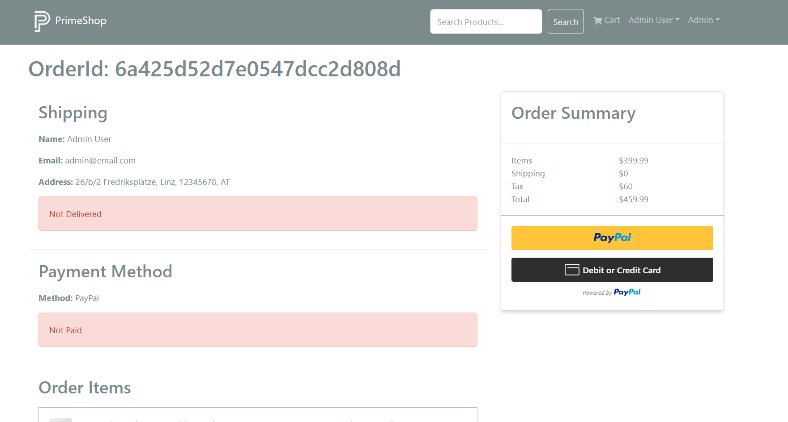

 


# 🛒 PrimeShop - MERN Stack eCommerce Application

A full-stack eCommerce web application built using the **MERN Stack (MongoDB, Express.js, React, Node.js)**. PrimeShop provides a complete online shopping experience with secure authentication, product management, shopping cart, PayPal payments, order tracking, and an admin dashboard.

---

## 🚀 Live Features

### 👤 Customer Features

* User Registration & Login
* Secure JWT Authentication (HTTP-only Cookies)
* Browse Products
* Product Search
* Product Pagination
* Top Rated Products Carousel
* Product Details
* Product Reviews & Ratings
* Shopping Cart
* Shipping Information
* Payment Method Selection
* PayPal Checkout
* Place Orders
* View Order History
* User Profile Management
* Update Profile

---

### 🛠 Admin Features

* Admin Dashboard Access
* Create Products
* Update Products
* Delete Products
* Upload Product Images
* Manage Users
* Edit Users
* Delete Users
* View All Orders
* Mark Orders as Delivered

---

# 📸 Screenshots

> Add screenshots here.

Example:

```
/screenshots
    home.png
    product.png
    cart.png
    checkout.png
    admin-dashboard.png
```

Then include:

```md
## Home Page


## Product Page


```

---

# 🏗 Tech Stack

## Frontend

* React 19
* React Router v6
* Redux Toolkit
* RTK Query
* React Bootstrap
* Bootstrap 5
* React Helmet Async
* React Toastify
* Axios
* PayPal React SDK

---

## Backend

* Node.js
* Express.js 5
* MongoDB
* Mongoose
* JWT Authentication
* HTTP-only Cookies
* Multer
* Cookie Parser

---

## Database

* MongoDB Atlas

---

## Payment

* PayPal REST API

---

# 📂 Project Structure

```
PrimeShop-Ecommerce
│
├── backend
│   ├── config
│   ├── controllers
│   ├── data
│   ├── middlewares
│   ├── models
│   ├── routes
│   ├── uploads
│   ├── utils
│   └── server.js
│
├── frontend
│   ├── public
│   ├── src
│   │   ├── assets
│   │   ├── components
│   │   ├── screens
│   │   ├── slices
│   │   ├── utils
│   │   ├── store.js
│   │   └── index.js
│
├── package.json
└── README.md
```

---

# ✨ Frontend Highlights

## Routing

React Router v6 is used for routing.

### Public Routes

* Home
* Product Details
* Search
* Pagination
* Cart
* Login
* Register

### Protected Routes

* Shipping
* Payment
* Place Order
* Order Details
* Profile

### Admin Routes

* Product Management
* User Management
* Order Management
* Product Editing
* User Editing

---

## State Management

Redux Toolkit is used for global state management.

State includes:

* Authentication
* Shopping Cart
* RTK Query API Cache

---

## Data Fetching

RTK Query is used for:

* Product APIs
* User APIs
* Order APIs

Benefits:

* Automatic Caching
* Cache Invalidation
* Loading States
* Error Handling
* Optimistic Updates

---

## SEO

Implemented using

* React Helmet Async

for dynamic page titles and metadata.

---

# ⚙ Backend Highlights

## REST API

### Product APIs

```
GET      /api/products
GET      /api/products/:id
GET      /api/products/top
POST     /api/products
PUT      /api/products/:id
DELETE   /api/products/:id
POST     /api/products/:id/reviews
```

---

### User APIs

```
POST     /api/users
POST     /api/users/auth
POST     /api/users/logout

GET      /api/users/profile
PUT      /api/users/profile

GET      /api/users
GET      /api/users/:id
PUT      /api/users/:id
DELETE   /api/users/:id
```

---

### Order APIs

```
POST     /api/orders
GET      /api/orders
GET      /api/orders/mine
GET      /api/orders/:id

PUT      /api/orders/:id/pay
PUT      /api/orders/:id/deliver
```

---

### Upload API

```
POST     /api/upload
```

Supports:

* JPG
* JPEG
* PNG
* WEBP

using Multer.

---

# 🔐 Authentication

Authentication is implemented using:

* JWT
* HTTP-only Cookies
* Protected Routes
* Admin Authorization Middleware

Passwords are securely hashed before storage.

---

# 💳 Payment Integration

Integrated with

* PayPal Sandbox

Features include:

* Secure Payment
* Order Payment Status
* Payment Verification

---

# 📁 Image Uploads

Implemented using **Multer**.

Features:

* Image validation
* Image storage
* Custom filenames
* Static uploads directory

---

# 🔒 Middleware

Custom middleware includes:

* Authentication Middleware
* Admin Middleware
* Error Handler
* Async Handler
* ObjectId Validation
* Not Found Handler

---

# 🌐 Environment Variables

Create a `.env` file inside the backend directory.

```env
NODE_ENV=development

PORT=5000

MONGO_URI=your_mongodb_connection_string

JWT_SECRET=your_jwt_secret

PAYPAL_CLIENT_ID=your_paypal_client_id

PAYPAL_APP_SECRET=your_paypal_secret

PAYPAL_API_URL=https://api-m.sandbox.paypal.com
```

---

# ⚡ Installation

## Clone the repository

```bash
git clone https://github.com/iamskyy666/primeshop-ecommerce.git
```

```
cd primeshop-ecommerce
```

---

## Install backend dependencies

```bash
npm install
```

---

## Install frontend dependencies

```bash
cd frontend

npm install
```

---

# ▶ Running the Application

## Development

From the project root

```bash
npm run dev
```

Runs

* Backend

```
http://localhost:5000
```

* Frontend

```
http://localhost:3000
```

---

## Backend Only

```bash
npm run server
```

---

## Frontend Only

```bash
npm run client
```

---

# 🌱 Seed Database

Import sample data

```bash
npm run data:import
```

Destroy sample data

```bash
npm run data:destroy
```

---

# 📦 NPM Scripts

```bash
npm run dev
```

Runs backend + frontend.

```bash
npm run server
```

Runs backend.

```bash
npm run client
```

Runs frontend.

```bash
npm run data:import
```

Imports sample data.

```bash
npm run data:destroy
```

Deletes sample data.

---

# 🛡 Security

* JWT Authentication
* HTTP-only Cookies
* Password Hashing
* Protected Routes
* Admin Authorization
* Input Validation
* Custom Error Handling

---

# 🚀 Future Improvements

* Wishlist
* Product Categories
* Coupon System
* Email Notifications
* Order Invoice PDF
* Stripe Integration
* Product Recommendations
* Dashboard Analytics
* Dark Mode
* Multi-language Support
* Docker Deployment
* CI/CD Pipeline

---

# 👨‍💻 Author

**Soumadip Banerjee**

GitHub:

[https://github.com/iamskyy666](https://github.com/iamskyy666)

---

# ⭐ Show Your Support

If you found this project helpful, consider giving it a ⭐ on GitHub!
